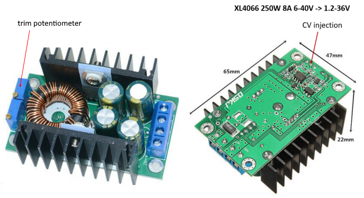

Practically every Buck converter regulates its output voltage over a feedback loop.
The output voltage goes through a resistive divisor into the feedback input of converter chip. The chip regulates the PWM output in order to keep a constant voltage 
on the feedback input. That constant voltage if determined by the chip and lies usually between 0.8V and 1.5V.
At a given output voltage, the resistive divisor (usually a trim potentiometer) can be seen as a voltage source with an internal resistance.
If you feed some current into that voltage source, or draw some current from that voltage source, you will increase/ decrease the resulting voltage, with the effect 
that the buck converter chip will compensate the change by an opposite change on the output voltage. 
The result will be that feeding some current into the potentiometer will reduce the output voltage, drawing some current from the potentiometer will increase the output voltage.
Of course, with that technique you cannot variate the output voltage from zero to the maximum. By fooling the feedback circuit, you reduce also the overall gain of 
the feedback loop.
Experience has shown, that an injection current changing the voltage by up to -100% to +10% was safe and efficient with every buck converter I have tested.
By the way, that this is also the technique used by many modules providing a current limitation functionality: an op amp monitors the output current and injects voltage into the 
feedback loop to reduce output voltage as the current increases.

**Image:** Typical buck converter

With the microcontroller, we can use the injection technique to provide neat things on an existing buck converter:
- digital control: with a direct digital output 3,3V to 5V over a 1k resistor and a diode,  you can shut down the buck converter: a high signal will increase the feedback voltage 
in such a way, the chip will virtually stop. 
- software CV control: with a PWM digital output, followed by a 1KOhm/1microfarad low pass filter and a high-value resistor (approximately 3 times the value of the potentiometer), 
you can variate the output of the converter by approximately +10% -30%, which is also the maximum variation you can reach, to keep the feedback loop working safely and not 
impacting too much the output voltage stability.
- software CC control: with the same circuit, and a current measurement e.g. by a chip like an INA226 or ACS712, together with a software feedback loop you can provide a kind of
current control. This software loop will however be considerably slower than the analog equivalent describe before and must be processed fast enough. 
- software MPPT control: with the same circuit, and a double current/voltage measurement by two chips like INA226 and the above-described software current feedback loop, you can 
provide a solar panel maximum power point tracking functionality. 

The importance of the neutral injection point: 
as already mentioned, but converters have a FB (feedback) voltage by design. The PWM injection circuit will feed current into the voltage 
potentiometer if it is over the FB voltage, and draw current from the potentiometer if it is below. If the FB voltage were at 1.65V (the half of 3,3V), you could increase 
decrease the output voltage by the same value. Usually the FB voltage is however lower 0.8V or 1.2V which means, you can decrease output voltage better, then you can increase it.
Fortunately is that is also, what we need by designing a battery charger.
In software, it is an advantage to know which PWM value will correspond to the FB voltage and be the neutral point, where current is whether fed, nor drawn from the feedback 
circuit. It is a good praxis to initialize the PWM outputs upon booting to that value.

**Caveats:**

The injection technique is safe to use for a limited range of output voltages, ideally, what is required for battery charging and solar controllers.
The software cc control is however too slow to protect the buck controller against inadvertent shorts; small buck converters without currently limitation will burn 
without notice...

Why tweaking commercial Buck converters and not PWM directly the buck converter functionality in software?

There are several reasons for this:

- The first one is efficiency: The PWM signal of most microcontrollers have a fixed frequency around a few KHz. 
Sure, you can operate a buck conversion at that frequency, but it is far from being efficient. 
The state of the art is switching between 100Khz and 1MHz, requiring much smaller inductors and filter capacitors.

- The second one is safety: The buck converters will be set to generate a safe voltage on their own immediately after power on, right before the microcontroller will 
have finished to boot. Mainly you can design the circuit to work, without the microcontroller, this one being only care to optimize the operation.

- The third one is design: Designing a buck converter is not something to improvise, the PCB must be designed in such a way to reduce the impact of high current pulses onto 
the feedback circuit and GND traces must be carefully routed. All that has been already cared for by the designers of your commercial buck converter and tested to a commercial grade, less sorrows and trouble for you.
 
Enjoy!
